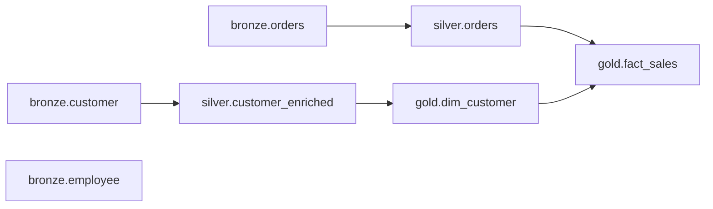

**Pipeline Engineering · part 1 of 4** — the design of the package and its YAML schema, engine-agnostic. Parts 2–4 rebuild it in the open and put it on Fabric and Databricks; the later links land as each part publishes.

> **A note on the code.** I've built this before, in a platform I can't open-source, so I'm rebuilding it in public. The package ships with part 2; this post is the design behind it.

The core idea is **config over code**: onboarding a new table becomes a few lines of YAML, not a new notebook or a copy-pasted pipeline. What that's worth — and the handful of design decisions that make it hold up across ingest, modeling, and every environment you deploy to — is the rest of this post.

## Where this comes from

A few years ago I built the ingestion layer for a lakehouse with ten source systems. I didn't plan it; it grew.

It started with the ERP: Dynamics 365 Finance & Operations, landing in the lake via Export to Data Lake. There was one environment at first, but more were coming, one per region, as the migration rolled out. So the notebook was parameterised from day one: one file, a loop over instances, the logic to pick up the exported files and merge them into bronze generic inside. Instances kept arriving for months, and not once did that file have to change. I was reasonably proud of it.

The other systems arrived in the middle of all that. First the CRM, Dynamics Customer Engagement via Synapse Link. Different system, different export format, but the shape of the job was the same: read what landed, add a few columns, merge. So I copied the ERP file, swapped the reader, adjusted the logic, and had a second file. Then SharePoint, which isn't an export at all but a Graph API you have to page through. Then Entra, also Graph, different flavour. Then the on-prem SQL Server over JDBC. By the time we were at ten systems I had ten files, each one a copy of the last with the source-specific part rewritten, and each one its own step in the job.

I want to be clear that this wasn't the "one notebook per table" mess you read about. Every file was generic *within* its system. The problem sat between the files.

It showed the first time I wanted something everywhere at once. I wanted lineage columns on every table, `_inserted_at`, `_updated_at`, `_source_system` and so on, so that downstream layers could stop guessing where a row came from. That's a change in every file. Not hard, just tedious, and easy to get subtly wrong in file seven because file seven had drifted a little from file three months ago.

Then I needed multithreading, because sequential steps were too slow, and that was going to be the same change in every file again. And I already knew what was queued behind it: retries, so a throttled API call wouldn't take a table down, and proper error handling, so one failed table wouldn't take the whole run down with it. Same edit, in every file, twice more.

Two things fell out of that. First, the part that differed between systems wasn't really *logic*; it was *description*: which system, which object, which key, how to merge. That's data, and I'd been encoding it as code ten times over. Second, the systems had stopped being interchangeable a long time ago: files landing in the lake for Dynamics, JDBC for SQL Server, Graph for SharePoint and Entra. The copy-paste approach hid that by pretending every source was the same shape of file. What I actually needed was one description format and a small set of source adapters behind it.

So I refactored the whole thing on top of that idea. This series is about what came out of it: a metadata-driven package that reads a YAML description of what to move and turns it into a runnable dependency tree, first engine-agnostic, then on Fabric and Databricks.

## The idea — metadata-driven orchestration

Put the description in declarative metadata, a YAML file, and write the "how" exactly once, in a small package that reads that metadata and does the work. Onboarding the eleventh system, or the next table from an existing one, becomes a few lines of YAML instead of another file. The cross-cutting change becomes one edit in one place. And "what do we ingest from the CRM?" becomes a file you can just read.

```yaml
# one table, as a block in the metadata
customer:
  source:
    system: crm_dataverse
    object: account
  business_key: [accountid]
  strategy: scd2
```

The read, the merge, the history: all of it lives once in the package now.

Concretely, the package keeps four things separate that hand-written pipelines always tangle together:

- **What** runs — the metadata: which tables, from which systems, with which keys and merge strategy.
- **In what order** — a dependency graph the package derives itself, so you never hand-sequence anything.
- **How** it runs — an engine-agnostic executor; the Spark-specific parts are adapters, not something you touch per table.
- **Where** it lives — versioned files in the repo, so the *same* config promotes from dev to prod through CI/CD.

This isn't a brand-new idea, and I want to be honest about that up front. Azure Data Factory and Fabric ship a [metadata-driven copy](https://learn.microsoft.com/en-us/azure/data-factory/copy-data-tool-metadata-driven) built on control tables, but it's copy-centric and stops at ingestion. [dbt](https://www.getdbt.com/) made transformations config-driven, but it's SQL-transform-only and never touches extract. Microsoft even publishes a [config-driven-data-pipeline](https://github.com/Azure/config-driven-data-pipeline) sample, but it's JSON and tied to Databricks. The gap this package fills is the boring, useful middle: one YAML that covers ingest *through* modeling (SCD, star schema), the same way on Fabric and Databricks, versioned as code.

Two rules make that livable. **Convention over configuration**: sensible defaults, so a table block only spells out its exceptions. And **config over code**: the metadata is the single source of truth, the package is just the interpreter. Everything in the rest of this post is one of those two rules applied to a specific problem.

## The YAML schema — layer by layer

The config is organised by layer, medallion-style: each layer is a top-level key, and every table sits under it as its own block, keyed by the table name. One table, one block. That mapping is deliberate, and the dependency parsing further down leans on it. Here's enough of the schema to read the whole shape:

```yaml
defaults:
  system_columns:
    - _inserted_at
    - _updated_at
    - _is_deleted
    - _execution_id
    - _source_system

systems: # declared once, referenced by name
  erp_d365:
    type: d365_export # files landed by Export to Data Lake
    landing_path:
      secret: erp-landing-path # resolved per environment
  crm_dataverse:
    type: synapse_link
    landing_path:
      secret: crm-landing-path
  hr_sqlserver:
    type: sqlserver
    host:
      secret: hr-host
    database: hr # literal, same in every environment
    auth:
      type: sql
      user:
        secret: hr-user
      password:
        secret: hr-pw
  sharepoint:
    type: custom # your own Spark data source, see below
    class: sources.graph.SharePointListSource
    tenant:
      secret: sp-tenant

bronze: # extract layer; table_schema defaults to the layer name
  tables:
    customer:
      source:
        system: crm_dataverse
        object: account
      business_key: [accountid]
      strategy: scd2 # scd2 | scd1 | replace | append
      merge:
        sequence_by: [versionnumber]
        delete_when: "isdelete = true"
        delete_mode: soft # soft | hard | ignore
        ignore_columns: [modifiedon] # excluded from change detection
    orders:
      source:
        system: erp_d365
        object: SalesOrderHeader
      business_key: [order_id]
      strategy: scd1
    employee:
      source:
        system: hr_sqlserver
        object: dbo.Employee
      business_key: [employee_id]
      strategy: scd1

silver: # logic lives in a notebook
  tables:
    customer_enriched:
      logic: notebooks/silver/customer_enriched.sql # SQL or PySpark
      business_key: [accountid]
      strategy: replace
      depends_on: auto # derived from the logic (see below)
    orders:
      logic: notebooks/silver/orders.sql
      business_key: [order_id]
      strategy: replace
      depends_on: auto
```

Five decisions in there are worth explaining.

**Systems are declared once.** Type, connection properties, and secret references live in the `systems` block and are referenced by name. Because paths, hosts and secrets are references, not literals, the *same* file runs against dev, test, and prod; only the resolved references differ. A table just says `system: crm_dataverse`, and the package stamps `_source_system` for you. Provenance comes from the reference, not a mapping you keep by hand.

**Source types are adapters.** This is the lesson from the ten files. A Dynamics export and a Graph API are not the same shape of read, and pretending they are is what made every copy drift. So `systems.<name>.type` picks a reader: `d365_export`, `synapse_link`, `sqlserver`, `kusto`, or `custom`, a Spark data source you build yourself with the [Python Data Source API](https://spark.apache.org/docs/latest/api/python/tutorial/sql/python_data_source.html) for things like Microsoft Graph. Downstream tables have no source; they point at a SQL or PySpark notebook that holds the logic. Every other field on a table block is identical across layers.

**Merge is the SCD strategy, full stop.** How matched rows are written is one field, `scd2 | scd1 | replace | append`, and there's deliberately no second "delta" mode next to it. Four knobs sit under `merge`, and each exists because leaving it out produces a specific kind of wrong data.

`ignore_columns` is change detection: by default the package compares every non-key column to decide whether a row changed, and you exclude the volatile ones (source-side audit timestamps, `last_seen_at`) here. Miss that and every run looks changed, and SCD2 fills with versions that mean nothing.

`sequence_by` decides which change wins when a batch contains more than one change for the same key. Without it, the winner is whatever order the rows happened to be processed in, which is not a property you want your history to depend on: a change feed can deliver updates out of order, and a full reload delivers them all at once. It takes a list so you can break ties on a second column, and the columns have to be sortable and non-null.

`delete_when` is the predicate that marks a row as deleted. You need it because the signal differs per source: Synapse Link flags deletes in the feed, a file export might only stop shipping the row, and a JDBC table might have its own soft-delete column. Hard-coding that per source is exactly the thing this package exists to avoid, so it's a field.

`delete_mode` is what actually happens when that predicate hits, and the default is `soft`: the row stays, `_is_deleted` is set, and on an SCD2 table the current version is closed rather than a new empty one opened. `hard` removes the row physically, and `ignore` drops the delete signal entirely, which is what you want when a source prunes records for operational reasons but you'd rather keep the history.

I'd argue `hard` is almost always the wrong answer for a source-driven delete. If bronze holds the history, deleting physically destroys the thing the layer exists for, and an accidental mass delete upstream — a failed migration, a bad filter on the export — stops being recoverable. Combined with `scd2` it's self-contradictory: you're keeping history and throwing it away in the same breath, so the loader rejects that combination instead of allowing it.

The one real case for physically removing rows is a legal erasure request, and that isn't a merge mode at all. It doesn't come from the change feed, it targets specific keys across every layer including closed SCD2 versions, and it has to be logged. That belongs in the package as its own operation, not in a table's description.

I allow `scd2` on bronze tables on purpose: history is captured where the data first lands, so everything downstream can be rebuilt from it. (Seeding and full reloads are run-level parameters, not per-table; see the next section.)

If this looks familiar from Databricks, it should: [`AUTO CDC`](https://docs.databricks.com/aws/en/ldp/cdc) expresses nearly the same thing in SQL, with `KEYS`, `SEQUENCE BY`, `APPLY AS DELETE WHEN`, `STORED AS SCD TYPE 2` and `TRACK HISTORY ON * EXCEPT`. That last one maps onto `ignore_columns` almost exactly: changes to untracked columns update the current row in place instead of opening a new version. The difference is scope. `AUTO CDC` runs inside Lakeflow pipelines and needs serverless or the Pro/Advanced edition, so it can't be the generic implementation behind an engine-agnostic executor. Part 4 puts the two side by side.

**You don't declare columns.** A block names its namespace and keys, never a column list; structure is read straight from the source. The hard part of that (inference, drift, type mapping) is a post of its own. Here it just keeps the metadata small.

**Modeling is built in.** A dimension can set `unknown_member: true` and the package seeds the default `-1` unknown member; facts then resolve missing foreign keys to it instead of leaving `NULL`s. And because the fact's logic reads the dimension, the ordering, dimensions before facts, is derived automatically, never declared:

```yaml
gold:
  tables:
    dim_customer:
      logic: notebooks/gold/dim_customer.sql # builds it from silver.customer_enriched
      business_key: [accountid]
      unknown_member: true # seeds the default -1 unknown member
      strategy: scd2

    fact_sales:
      logic: notebooks/gold/fact_sales.py # reads dim_customer → dependency derived
      business_key: [order_id]
      strategy: replace
```

One more thing you never write again: the audit columns. Every table gets them stamped by the package: `_inserted_at`, `_updated_at`, `_is_deleted`, `_execution_id`, `_source_system`, plus `_valid_from` / `_valid_to` / `_is_current` on SCD2 tables.

The timestamps deserve a sentence, because people ask. They're always UTC, and they're stored as a `bigint` in the form `YYMMddHHmmssSSS` (so `250908143012456` is 2025-09-08, 14:30:12.456 UTC), not as a timestamp type and not as epoch milliseconds. Epoch would be just as sortable and just as UTC, and every engine converts it natively. The reason I still prefer this format is that you can read it in a logging table or a debug query without converting anything, and `_execution_id` uses the same format, so a row and the run that wrote it line up at a glance. The trade-offs are real: two-digit year, and you shouldn't use the raw value as a unique ID when runs can start in the same millisecond. For lineage columns that's a trade I'm happy with.

## From metadata to dependency tree

The schema tells the package *what* each table is. The order to run them in is something the package works out for itself.

You can spell dependencies out, `depends_on: [dim_customer]`, but the more interesting path is not to. Every downstream table already points at a SQL or PySpark file that *reads* its inputs, so the dependency is sitting right there in the code. Set `depends_on: auto` and the package parses that file, pulls out the tables it reads, and builds the edges from them: no hand-kept lists, no drift between what the code reads and what the metadata claims.

That only works if the code is honest about what it reads, so the package asks for two conventions:

- **One output table per file**, otherwise the metadata can't say which table the block owns. It lines up one-to-one with "table name = the block."
- **Read your inputs at the top**, with `spark.table(...)` or `spark.sql(...)`:

```python
# notebooks/gold/fact_sales.py
orders   = spark.table("silver.orders")
customer = spark.table("gold.dim_customer")
# everything after — temp views, joins, logic — is yours
```

Those top-level reads are the dependency surface. For SQL files the package pulls table names from the `FROM` and `JOIN` clauses; for PySpark it scans for `spark.table("...")` and `spark.sql("...")` calls with literal strings. That's a deliberately simple parser, and it won't catch everything: a table name built at runtime (`spark.sql(f"select ... from {name}")`) or a file with several statements can't be read statically. Declare those with `depends_on` and move on.

From the edges, the package builds the tree, sorts it topologically for the run order, and stops on a cycle. A circular dependency buried in fifty tables is almost impossible to spot by eye, and the topological sort finds it for free. A table reading its own current state to merge incrementally is not a cycle in this sense; self-reads are simply ignored when building the edges.

Because the package holds the whole tree, it can also draw it. For the tables above:



That picture is usually the first time someone actually *sees* their pipeline instead of trusting a run order they wired by hand. (Rendering the tree is on the list for the rebuild; the graph itself is what the executor runs on either way.)

The tree also decides what a re-run touches: a single table, or a table and everything downstream of it. That second mode is the one I want for CI/CD: the release pipeline hands the package the tables that changed, and it re-runs each of them plus every dependent, so a new column added upstream actually propagates through the whole subtree instead of leaving stale schemas behind. Two caveats. This subtree mode isn't rebuilt yet, and overriding a single table in isolation can leave `_execution_id` out of step across the tree, depending on how the incremental load resolves it. The subtree override is usually what you want.

Two things deliberately don't live in the YAML: seeding and full reloads. Both describe a run, not a table. "Rebuild this from the source now" is something you decide because a schema changed or an upstream load was wrong; it says nothing about what the table *is*, and the moment it sits in the config someone commits it and every scheduled run starts truncating. So they're parameters the executor takes. The tree still applies, and that matters more than it sounds: reloading a bronze table without its dependents leaves silver and gold sitting on data that no longer matches.

## How the package is built

Nothing so far needed to know it's running on Spark. The package is a few small layers, each testable on its own:

`YAML → config loader → typed model → graph builder → executor`

The loader reads and validates the metadata. Fail fast, so bad config never reaches execution. The model turns it into typed objects with defaults resolved. The graph builder does what the previous section described: edges, topological order, cycle check. And the **executor** is a deliberately thin interface, `run_table(table)`, that knows nothing about *how* a table is actually read or written. That seam is the whole reason one package runs on both Fabric and Databricks: the engine-specific parts sit behind it as adapters, and they're what parts 3 and 4 are about.

One thing worth settling here, because people ask it immediately: **execution follows the dependency tree, not the layers.** A layer is an organizing idea in the YAML, a namespace for related tables, not an execution barrier. Run it layer-by-layer and a gold table whose one dependency finished early still waits for the slowest, unrelated table in the layer above it. The tree already knows the *actual* dependencies, so the package starts each table the moment its parents are done and nothing else holds it up. How that parallel walk is scheduled, and what happens when a table in the middle of the tree fails, is exactly what part 2 is about.

## What you actually get

Two rules, applied over and over. *Config over code:* the metadata is the source of truth and one small package interprets it, so onboarding a table is a YAML block, a cross-cutting change is one edit, and the pipeline is something you can read and diff in a pull request. *Convention over configuration:* one table per file, inputs at the top, sensible defaults, audit columns for free, so a table block only ever spells out its exceptions. The engine underneath can be Fabric or Databricks, but the description of what runs, and the package that turns it into a runnable tree, stays the same.

## What's next

This was the foundation: the metadata, the schema, and how the package turns one into a runnable tree. The rest of the series builds on it, and the package goes public with part 2, so the links below appear as each one publishes.

- **Part 2 — Multithreading & failure handling.** Running the tree in parallel, and what happens when one table fails: log it, keep going, digest the failures, instead of killing the whole run. Plus the repo.
- **Part 3 — Fabric.** The same package on Spark vs. Data Factory pipelines, side by side.
- **Part 4 — Databricks.** The same package on Spark vs. Declarative Pipelines.
